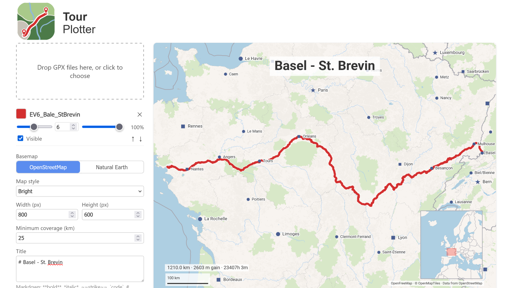

<picture>
   <source srcset="./src/lib/assets/logo-wordmark-dark.svg" media="(prefers-color-scheme: dark)" />
   
</picture>

Renders one or more GPX tracks over a minimal basemap (no roads, terrain, or
landuse) and exports the result as a PNG or SVG at a user-chosen resolution.

Framing is automatic: the app computes a bounding box from the loaded tracks
(expanded to a minimum coverage floor so small tracks don't zoom to street
level) and fits a projection to it. There is no manual pan/zoom step.

<picture>
   <source srcset="./docs/app-screen-shot-dark.png" media="(prefers-color-scheme: dark)" />
   
</picture>

## Installation

Make sure the following prerequisites are installed:

- [Git](https://git-scm.com/)
- [Node.js](https://nodejs.org/) 24+ (with npm)

```bash
git clone https://github.com/andju/tour-plotter.git
cd tour-plotter
npm ci
```

### Run the development server

```bash
npm run dev
```

The app will be available at [http://localhost:5173](http://localhost:5173).
   

### Build and Export

- **Production build:** `npm run build` → outputs to `build/`
- **Preview production build locally:** `npm run preview`

## Tech Stack

SvelteKit (Svelte 5, runes mode) + TypeScript, `adapter-static`, client-only
(`ssr = false`, `prerender = true` in `src/routes/+layout.ts`). Vitest for unit
tests, Playwright/Chromium for e2e. Node 24 / npm 11.

Rendering is **d3-geo drawing to Canvas 2D or SVG**, not a tiled map library
(Leaflet/MapLibre). That choice follows directly from the app's two hard
requirements: export size is fixed by the user, not the viewport, and framing is
computed automatically from track bounds rather than composed by hand.
Tile-based maps snap to discrete zoom levels and cap out on WebGL canvas size;
`d3.geoMercator` + `geoPath` give exact, resolution-independent framing with no
size ceiling.

Basemap data comes from one of two sources, selectable in the Export panel:

- [Natural Earth](https://www.naturalearthdata.com/) (public domain, no
  attribution required), fetched and trimmed once via `npm run fetch-basemap`
  into `static/basemap/*.json` — land, country borders, state/province
  borders, and cities (filtered to `scalerank` in the shipped data; the "major
  cities" UI slider filters further at render time). No tile server, no API
  key, fully offline-capable.
- OpenStreetMap vector tiles, fetched live per-request from
  [OpenFreeMap](https://openfreemap.org/) (`OpenFreeMap · © OpenMapTiles ·
  Data from OpenStreetMap`), decoded and cached per bbox/zoom. This is the
  default and requires network access.

## Basemap Data (`static/basemap/`)

These files are a build-time snapshot, so the app has offline-capable land/border/place data with no API
key and no tile server for the Natural Earth basemap option.

Source: [Natural Earth](https://www.naturalearthdata.com/) (public domain)
via [martynafford/natural-earth-geojson](https://github.com/martynafford/natural-earth-geojson),
a pre-converted GeoJSON mirror of Natural Earth's shapefiles.

Several layers exist twice at different resolutions — that's intentional, not duplication to clean up:

- `land.json` / `admin0-borders.json` / `admin1-borders.json` / `lakes.json` /
  `rivers.json` / `urban.json` / `countries.json` — 50m ("minimalistic")
  scale, used for the main map render.
- `world-land.json` / `world-admin0.json` — coarser 110m scale, used only by
  the small (~180px) minimap inset, which renders a whole continent or the
  whole world at once and gains nothing from 50m detail. These two are also
  loaded even when the main basemap is set to OpenStreetMap, since OSM's
  vector tiles carry no land or admin0 layer for the minimap to use.
- `cities.json` / `towns.json` — `cities.json` is the 50m populated-places
  layer (with per-language name columns, for the city-label language picker);
  `towns.json` is the finer 10m populated-places layer, de-duplicated against
  `cities.json` by name, and is only ever loaded alongside it to back the
  city-size slider.

To refresh all of the above from upstream Natural Earth data, run:

```bash
npm run fetch-basemap
```

This re-downloads every layer, re-applies the trimming/rounding rules, and
overwrites `static/basemap/*.json` in place. Review the diff before
committing — Natural Earth data changes rarely, but the script has no
dry-run mode.